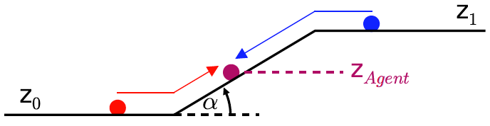
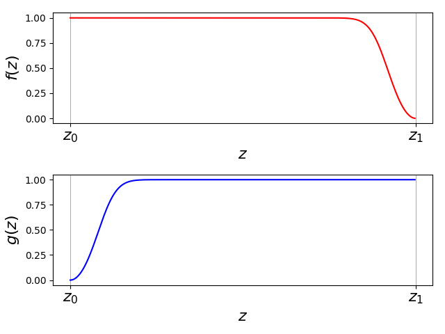
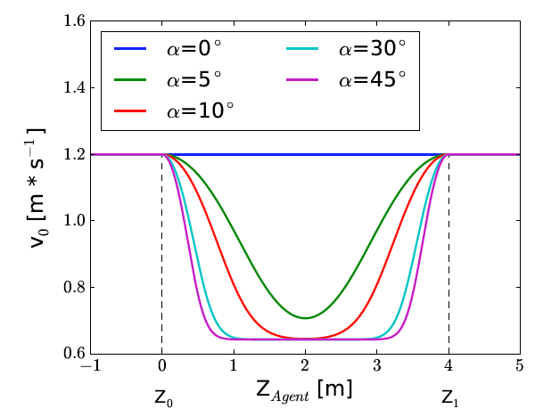

========================================
Modeling the change of the desired speed
========================================

.. warning::

  This modelling of the desired speed in the
  transition area of planes and stairs is not validated, since
  experimental data are missing.

Definitions
===========

Assume the following scenario, with two horizontal planes and a stair,
where :math:`z_0<z_1` and the inclination of the stair :math:`\alpha`.

   Speed curve in the transition area between levels and stairs

The agent has a desired speed on the horizontal plane :math:`v^0_{\text{horizontal}}`
and a *different* desired speed on the stair :math:`v^0_{\text{stair}}`.

Given a stair connecting two horizontal floors, we define the following
functions:

.. math::

   f(z) = \frac{2}{1 + \exp\Big(-c\cdot \alpha (z-z_1)^2)\Big)} - 1,

and

.. math::

   g(z) =  \frac{2}{1 + \exp\Big(-c\cdot \alpha ((z-z_0)^2)\Big)} - 1.

   .. math:: f(z)

   \ and decreasing function $$g(z)

   Increasing function

   .. math:: f(z)

   \ and decreasing function $$g(z)

Function of the desired speed
=============================

Taking the previously introduced quantities into consideration, we can
define the desired speed of the agent with respect to its :math:`z`-component as

.. math::

   v^0(z) = v^0_{\text{horizontal}}\cdot\Big(1 − f(z)\cdot g(z)\Big)   + v^0_{\text{stair}}\cdot f(z)\cdot g(z),

:math:`c` is a constant.

The following figure shows the changes of the desired speed with respect
to the inclination of the stair :math:`\alpha`.
The steeper the inclination of the stair, the faster is the change of
the desired speed.

   Transition area of levels and stairs

.. note::
    The value of *c* should be chosen so that
    the function grows fast (but smooth) from 0 to 1. However, in
    force-based models the speed is adapted exponentially from zero to the
    desired speed. Therefore, the parameter tau must be taken into
    consideration.
