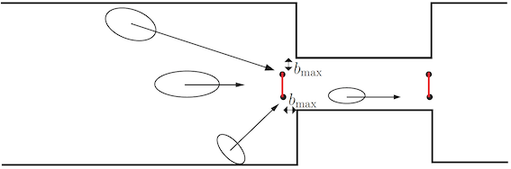
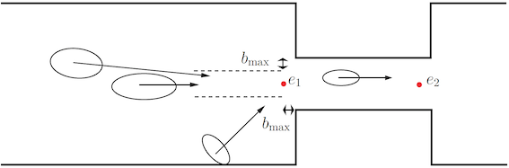
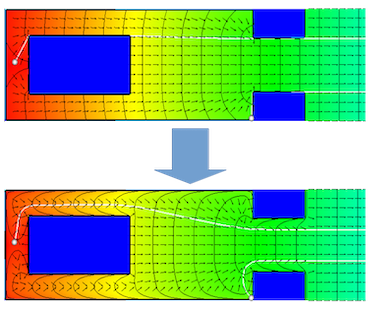

====================
Direction strategies
====================

Introduction
============

The chosen model the direction strategy should be specified in the
`inifile <jpscore_inifile.html>`__ as follows

.. code:: xml

    <exit_crossing_strategy>num</exit_crossing_strategy>

with *num* a positive integer.

The majority of the strategies define how a pedestrian crosses a line :math:`L = [P_1, P_2]`. Possible values are:

Strategy 1
==========

The direction of the pedestrian is towards the middle of :math:`L(\frac{P_1+P2}{2})`

|Strategy 1: Goal towards the center of the door|

Strategy 2
==========

Choose the nearest point on the *line* :math:`L`. If the nearest point of the
pedestrian on the line :math:`L` is outside the segment, then chose the middle
point as target. Otherwise the nearest point is chosen.

|Strategy 2: Goal towards the nearest point on the door.|

Strategy 3
==========

The direction is given by the nearest point on :math:`L` to the position of the
pedestrian. :math:`L` is shorten by the shoulder width of the pedestrians
(+10 cm).
|Strategy 3: Goal towards the center if pedestrian is out of range of the door.|

Strategy 8
==========
.. note::
    For this to work properly the `floor field router <jpscore_routing.html#floorfield-router>`__
    has to be used.

For more details see this
`talk <https://fz-juelich.sciebo.de/index.php/s/s1ORGTUssCsHDHC>`__ and
the corresponding
`thesis <https://fz-juelich.sciebo.de/index.php/s/VFnUCH2gtz1mSoL>`__.

This strategy uses a floor field collection for each room.

The following parameters of an enhanced floor field can be changed:

- ``delta_h``: discretization/stepsize of grid-points used by the floor field

- ``wall_avoid_distance``: below this wall-distance, the floor field will show a wall-repulsive character, directing agents away from the wall

- ``use_wall_avoidance``: {true, false} switch to turn on/off the enhancement of the floor field

.. note::
    It’s recommended to choose a reasonable
    value of the ``wall_avoid_distance`` (shoulder width of an average
    pedestrian) in order to not steer pedestrians too close to walls

|Floorfield: Changing the minimal distance to the walls to guarantee a “safe” route.|

Usage example:

.. code:: xml

   <model_parameters>
       <exit_crossing_strategy>8</exit_crossing_strategy>
       <delta_h>0.0625</delta_h>
       <wall_avoid_distance>0.8</wall_avoid_distance>
       <use_wall_avoidance>true</use_wall_avoidance>
   </model_parameters>

Here the floor fields are smaller but cannot steer to targets in a
different room. The router **must** provide intermediate targets for
every agent, the target being in the same room.

.. warning::
    The projection of the room onto the :math:`x,\, y`-plane must be non-overlapping!

.. warning::
    Do not use in multi-storage buildings!

--------------

.. |Strategy 1: Goal towards the center of the door| image:: ../images/strategy1.png

