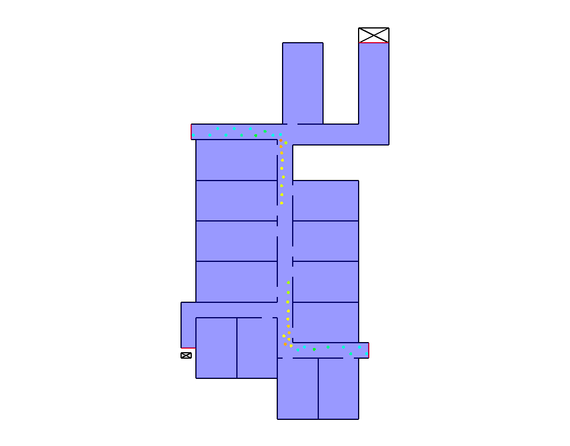

=============================
Getting started with jupedsim
=============================

|DOI|

``jpscore`` implements models on the operational as well as on the
tactical level of pedestrian dynamics.

Demo files
==========

In the directory ``demos`` there are some examples to start with:

.. code:: bash

   ├── demos
   │   ├── scenario_1_corridor
   │   │   ├── corridor_geo.xml
   │   │   ├── corridor_ini.xml
   │   ├── scenario_2_bottleneck
   │   │   ├── bottleneck_geo.xml
   │   │   └── bottleneck_ini.xml
   │   ├── scenario_3_corner
   │   │   ├── corner_geo.xml
   │   │   ├── corner_ini.xml
   │   │   └── corner_routing.xml
   │   ├── scenario_4_stairs
   │   │   ├── stairs_geo.xml
   │   │   ├── stairs_ini.xml
   │   │   └── stairs_routing.xml
       │   ├── scenario_7_floorfield
   │   │   ├── Kobes_geo.xml
   │   │   ├── ffRouter_ini.xml
   |
   |
   |.....
   │

Taking the 7th demo as input, we run a simulation as follows:

.. code:: bash

    ./bin/jpscore  demos/corner_ini.xml

Information on processing steps, warnings and errors of jpscore are
written to the console. This output can be redirected to a file by:

.. code:: bash

    ./bin/jpscore  demos/corner_ini.xml > log_example.txt

This program call produces a trajectory file in the folder ``results``
in the same directory. This can be visualized with ``jpsvis``

.. code:: bash

    jpsvis demos/scenario_7_floorfield/results/Kobes_traj.xml

   Simulation using demo 7 of ``jpscore``

.. |DOI| image:: https://zenodo.org/badge/36440436.svg
   :target: https://zenodo.org/badge/latestdoi/36440436
